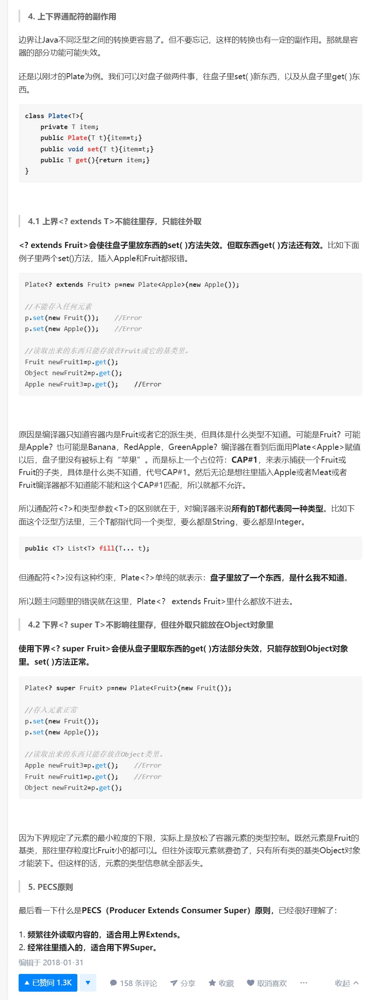

# 为什么需要泛型

譬如我们需要一个数组类IntList，它存放int类型，并且有我们自定义的增加、删除、排序功能。

后来我们发现只有一个int类型的数组不够，我们还需要一个有同样功能的数组类StringList，那么这时候就要再new一个class文件，这就十分繁琐了

泛型就是解决这个问题的。它在定义时可以告诉编译器：我不把其中的参数类型写死，它可以是int、String等等，这个由我以后使用的时候决定

# 泛型怎么使用

## 在定义的时候

如果当前的类有可能会需要用到多种数据类型，那这个时候就要在class上注明<T>。例如：
```
    public class MyList<T>{ 
        //key这个成员变量的类型为T,T的类型由外部指定  
        private T key;
    
        public MyList(T key) { //泛型构造方法形参key的类型也为T，T的类型由外部指定
            this.key = key;
        }
    
        public T getKey(){ //泛型方法getKey的返回值类型为T，T的类型由外部指定
            return key;
        }
    }
```

## 在使用的时候

1. 创建泛型类对象：泛型写实际使用的参数`MyList<String> myList = new MyList<String>("字符串");`
2. 使用泛型类对象作为参数：
如果能确定将接收到的泛型类的参数，就直接指定好：`public void showKeyValue(MyList<String> myList){...}`
如果不确定，就写作<?>：`public void showKeyValue(MyList<?> myList){...}`

# 上下界

- extends和super都不能在泛型类**定义**时使用
- super只能在**使用泛型类对象作为参数**时使用，不能用于**创建泛型类对象**；extends无限制

# 限制

详见：[泛型使用的8个限制](https://blog.csdn.net/hanchao5272/article/details/79352321)

# 副作用



摘自：[Java 泛型 <? super T> 中 super 怎么 理解？与 extends 有何不同？ - 胖君的回答](https://www.zhihu.com/question/20400700/answer/117464182)